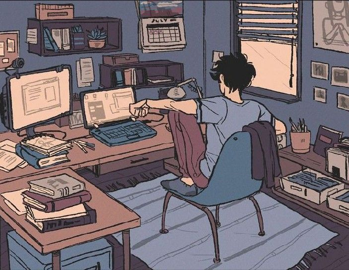

<!-- Profile Header -->

  

<h1 align="center">Hi, I’m Julker Nayeen Karim </h1>
<h3 align="center">3rd-Year CSE @ AUST · Full-Stack Developer</h3>

---

## ⚙️ Tech Stack

### 💻 Languages  

### 🎨 Frontend  

### ⚡ Backend  

### 🗄️ Database  

### 🔧 Tools  

---

## 📊 GitHub Stats

  
  

---

## 🌐 Connect With Me

  
  

  

